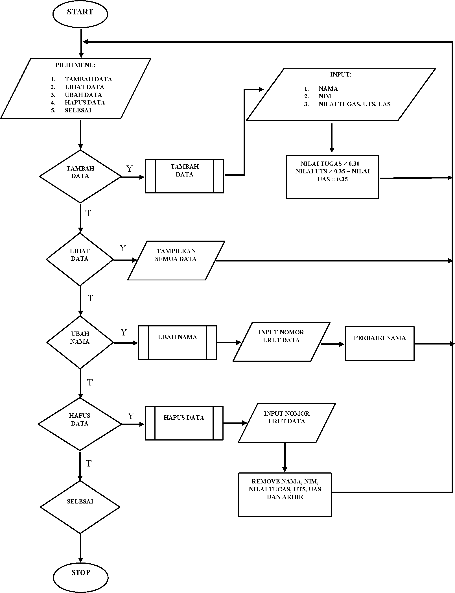
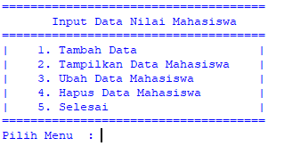
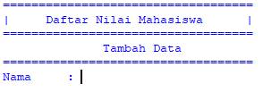
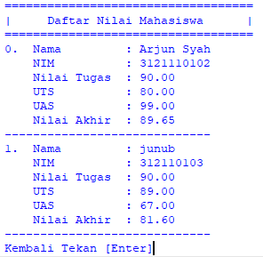
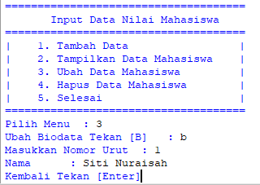
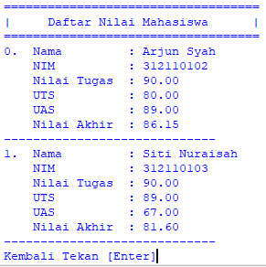
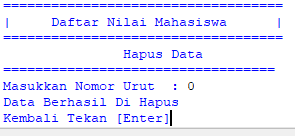

# labs06
# Funnction
### Bentuk flowchart

```python
from os import system
```
- diatas code untuk mengimport, untuk mendapatkan clear system pada system os

```python
nama1 = []
nim1 = []
tugas1 = []
uts1 = []
uas1 = []
akhir1 = []
```
- diatas code untuk meembuat list/menampung data dalam bentuk list

```python
def judul():
    print("="*35)
    print("|     Daftar Nilai Mahasiswa      |")
    print("="*35)
```
- diatas code untuk menampilkan funngsi judul, karna ini function jadi kita bisa memanggil fungsi ini berkali kali, tanpa harus menulis ulang programnya, kita hanya perlu lmemanggilnya dengan cara mengetikan program *Contoh : fungsi()


```python
def menu():
    system("cls")
    print("="*37)
    print("Input Data Nilai Mahasiswa".center(40))
    print("="*37)
    print("|    1. Tambah Data                 |")
    print("|    2. Tampilkan Data Mahasiswa    |")
    print("|    3. Ubah Data Mahasiswa         |")
    print("|    4. Hapus Data Mahasiswa        |")
    print("|    5. Selesai                     |")
    print("="*37)
    pilih = input("Pilih Menu  : ")
    if pilih == "1":
        tambah()
    elif pilih == "2":
        tampilkan()
    elif pilih == "3":
        ubah()
    elif pilih == "4":
        hapus()
    elif pilih == "5":
        selesai()
    else:
        tidak = input("Menu Tidak Ada")
        system("cls")
        menu()
```
- diatas program untuk menampilkan fungsi menu, dengan ketentuan, jika menekan angka 1 maka akan menambah data, jika menekan angka 2 akan menampilkan data, angka 3 akan mengubah data, angka 4 menghapus data, dan angka 5 untuk menutup program
### Tampilan programnya

```python
def tambah():
    system("cls")
    judul()
    print("Tambah Data".center(40))
    print("="*35)
    nama = input("Nama     : ")
    nama1.append(nama)
    nim = input("NIM      : ")
    nim1.append(nim)

    system("cls")
    judul()
    print("Tambah Data".center(40))
    print("="*34)
    tugas = float(input("Nilai Tugas    : "))
    tugas1.append(tugas)

    uts = float(input("Nilai UTS      : "))
    uts1.append(uts)

    uas = float(input("Nilai UAS      : "))
    uas1.append(uas)

    total = tugas * 0.30 + uts * 0.35 + uas * 0.35
    akhir1.append(total)
    print("Data Tersimpan".center(40))
    kembali = input("Kembali [Enter]")
    menu()
```
- diatas adalah code untuk membuat fungsi tambah
### Tampilan programnya

```python
def tampilkan():
    system("cls")
    judul()

    for i in range(len(nim1)):

        print("%d.  Nama         : %s"%(i+0, nama1[i]))
        print("    NIM          : %s"%nim1[i])
        print("    Nilai Tugas  : %.2f"%tugas1[i])
        print("    UTS          : %.2f"%uts1[i])
        print("    UAS          : %.2f"%uas1[i])
        print("    Nilai Akhir  : %.2f"%akhir1[i])
        print("-"*29)
    kembali = input("Kembali Tekan [Enter]")
    menu()
```
- diatas adalah code untuk membuat fungsi menampilkan data dalam list
### Tampilan programnya

```python
def ubah():
    rubah = input("Ubah Biodata Tekan [B]   : ")
    if rubah == "B" or rubah == "b":
        i = int(input("Masukkan Nomor Urut  : "))
        if (i > len(nim1[i])):
            print("Nomor Urut Salah")
        else:
            namabaru = input("Nama      : ")
            nama1[i] = namabaru
    kembali = input("Kembali Tekan [Enter]")
    menu()
```
- diatas adalah code untuk membuat fungsi untuk merubah nama dalam data, dengan ketentuan, jika menekan angka 3 maka muncul konfirmasi dan harus menginputkan/menekan huruf b setelahnya juga harus menginputkan no urut data yang ingin di ubah
### Tampilan programnya



```python
def hapus():
    system("cls")
    judul()
    print("Hapus Data".center(40))
    print("="*34)
    i = int(input("Masukkan Nomor Urut  : "))

    if (i > len(nim1[i])):
        tidak = input("NIM Tidak Ada")
        hapus()
    
    else:
        nim1.remove(nim1[i])
        nama1.remove(nama1[i])
        tugas1.remove(tugas1[i])
        uts1.remove(uts1[i])
        uas1.remove(uas1[i])
        akhir1.remove(akhir1[i])

    print("Data Berhasil Di Hapus")
    kembali = input("Kembali Tekan [Enter]")
    menu()
```
- diatas adalah code untuk membuat fungsi menghapus salah satu dari data dalam list, jika menekan angka 4, selanjutnya kita harus menginputkan no  urut data yang ingin dihapus
### Tampilan programnya

```python
def selesai():
    system("cls")
    menu()

menu()
```
- diatas adalah program untuk fungsi mengakhiri program, dengan menekan angka 5 maka akan menyekesaikan program 
## Program Selesai
# Sekian Terimakasih


